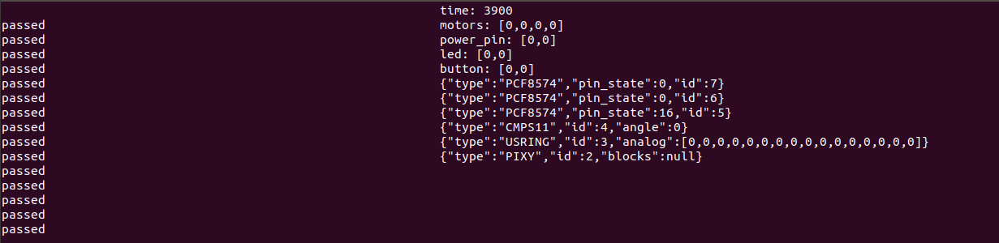

#Goldboard4 Simulator basierend auf simavr

Dies ist ein Simulator für das Goldboard4 basierend auf [simavr](https://github.com/buserror/simavr). Er läd das hex file des compilierten Programms und führt es auf dem Pc aus. Zusätzlich können verschiedene Sensoren an dem Simulator angeschlossen werden.

#Was funktioniert

* Motoren
* CMPS11
* PCF8574

#Was funktioniert nicht

* Buttons
* Leds
* Pixy
* usring
* DigitalIO
* Analog
* LCD

#Contents

1. [Benutzung unter Windows](#Benutzung unter Windows)
1.2. [config.json](#config.json)
1.3. [Devices](#Devices)
1.4. [Konsole](#Konsole)
1.5. [Server](#Server)

##Benutzung unter Windows

Lade das Projekt von Github herunter und extrahiere es. Kopiere das compilierte programm (meist main.hex oder <projektname>.hex) in den Ordner mit der simulator.exe Datei. Konfiguriere config.json so wie du es brauchst. Starte simulator.exe.
Zum ausführen sind nur config.json, die programm Datei, libgcc_s_seh-1.dll und simulator.exe notwendig.

###config.json

config.json ist eine Konfigurationsdatei in der JavaScript Object Notation. Falls etwas nicht funktioniert ist vermutlich ein fehler in dieser Datei.

	* "firmware" ist der Datei name der hex Datei. Es kann auch ein relativer oder absoluter Pfad sein
	* "time_steps" sind die Zeitschritte in Millisekunden in denen das Programm Simuliert wird. Nach jedem Zeitschritt wird der Status ausgeben
	* "terminal" aktiviert die Konsolen Ausgabe. Wenn ihr nichts seht ist es vermutlich auf false. Näheres unter [Konsole](#Konsole).
	* "server" aktiviert den TCP Server. Näheres unter [Server](#Server).
	* "server_port" setzt den Port des Servers.
	* "devices" ist eine Liste aus Geräten die am Goldboard angeschlossen sind. mehr unter [Devices](#Devices)

'''Javascript
{
  "firmware" : "gb_programm.hex",
  "time_steps" : 100,
  "terminal" : true,
  "server" : false,
  "server_port" : 3030,
  "devices" : [{
       "type" : "PIXY",
    },{
       "type" : "USRING",
    },{
       "type" : "CMPS11",
    },{
       "type" : "PCF8574",
       "address" : 74
    },{
       "type" : "PCF8574",
       "address" : 68
    },{
       "type" : "PCF8574",
       "address" : 112
    }
  ]
}
'''

###Devices

Folgende Geräte stehen zur verfügung.

* PCF8574 (benötigt den Parameter "address" für die i2c Addresse)
* PIXY
* USRING
* CMPS11

###Konsole

Der linke Teil der Ausgabe ist der Serialport der Rechte Teil behinhaltet alle verfügbare Information über das Board.

 
Durch drücken der Nummer 0 können die Taster des Goldboards manipuliert werden.
Durch drücken der Nummer 2-9 können die angeschlossenen Geräte manipuliert werden. Das Programm wird dabei angehalten.

###Server

Der Server sendet eine json formatierte Datei, die den aktuellen Status des Goldboards beinhaltet. In diesem stehen auch alle manipulierbaren Werte wie Kompassrichtung oder Buttonstatus. Durch zurücksenden der gleichen Datei oder einer Manipulierten, wird das Programm ein Schritt weiter Simuliert und die Werte können erneut angepasst werden. Wichtig ist, dass die id der angeschlossenen Geräte nicht verändert wird.
